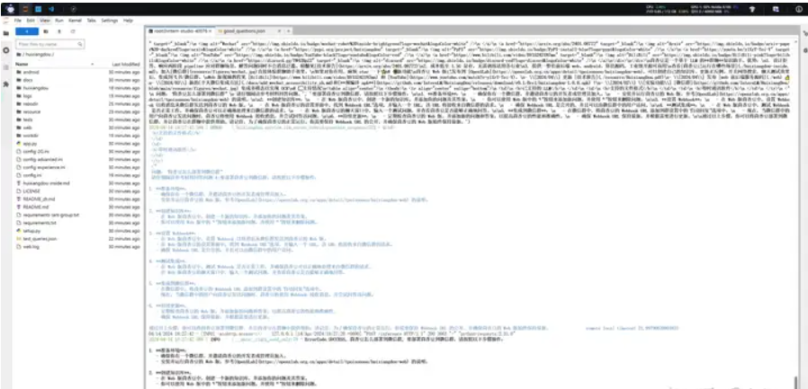
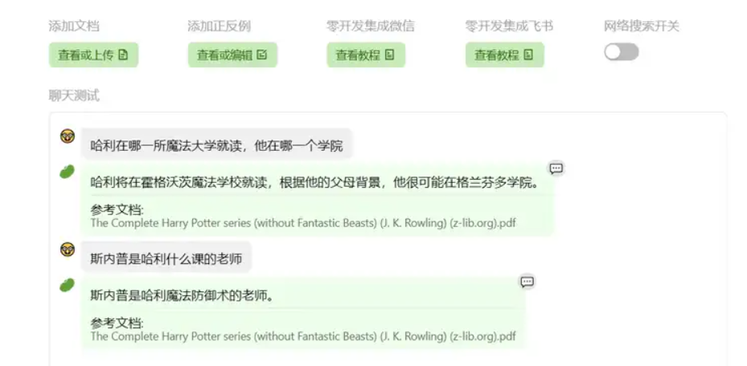

## 1. 在 `InternLM Studio` 上部署茴香豆技术助手

教程了选用**InternLM2-Chat-7B**作为基础模型，其中用到了BCE模型：

> 网易BCE双语模型指的是网易有道推出的一种自然语言处理模型，称为“Bilingual Co-training Encoder”（BCE），旨在提高跨语言的文本理解和生成能力。在实际应用中，该类型的模型能够帮助改进双语或多语场景下的应用体验，比如能够提供更准确的翻译服务，更有效的双语检索结果，或者更好的理解多语言用户生成的内容。

实战当中，茴香豆使用其技术文档作为语料来源建立知识库，提取知识库特征，创建向量数据库。

数据库向量化的过程应用到了**LangChain**的相关模块，默认嵌入和重排序模型调用的网易**BCE 双语模型**，如果没有在`config.ini`文件中指定本地模型路径，茴香豆将自动从**HuggingFace**拉取默认模型。

除了语料知识的向量数据库，茴香豆建立接受和拒答两个向量数据库，用来在检索的过程中更加精确的判断提问的相关性，这两个数据库的来源分别是：

- 接受问题列表，希望茴香豆助手回答的示例问题
  - 存储在 `huixiangdou/resource/good_questions.json` 中
  
- 拒绝问题列表，希望茴香豆助手拒答的示例问题
  - 存储在 `huixiangdou/resource/bad_questions.json` 中
  
  - 其中多为技术无关的主题或闲聊
  
  - 如："nihui 是谁", "具体在哪些位置进行修改？", "你是谁？", "1+1"
  
    

实战回答茴香豆如何部署到微信群

## 2. 在[茴香豆 Web 版](https://link.zhihu.com/?target=https%3A//openxlab.org.cn/apps/detail/tpoisonooo/huixiangdou-web)中创建自己领域的知识问答助手

参考视频[零编程玩转大模型，学习茴香豆部署群聊助手](https://link.zhihu.com/?target=https%3A//www.bilibili.com/video/BV1S2421N7mn)

直接在 [应用中心-OpenXLab](https://link.zhihu.com/?target=https%3A//openxlab.org.cn/apps/detail/tpoisonooo/huixiangdou-web) 中创建自己知识库，然后设置密码就可以进入应用界面。

这里我以哈利波特的纯英文电子书作为语料进行测试，由于构建茴香豆使用了 网易的BCE 双语模型，所以效果理论上也不错。

然后为了集成到实时通讯工具中，这里也有添加正反例的功能来判断是不是需要回答闲聊，尽量要涵盖一些比较广泛的反例类别。这里设置一些反例：

> 你看过哈利波特吗
> 你好啊
> 今天天气真好
> 我真是太喜欢哈利波特了
> 如何申请宿舍
>

![img](https://pic1.zhimg.com/80/v2-94e92fdd0e153871f0deecccdafdfdec_720w.webp

拒绝回答测试

可以看到就是上面的关于哈利波特全系列的故事细节，RAG做的还是相当成功的，同时对于推断能力层面也保留了LLM的语言理解能力，然后也能合理滤除闲聊的过程。接下来把这个RAG部署到飞书群聊当中。