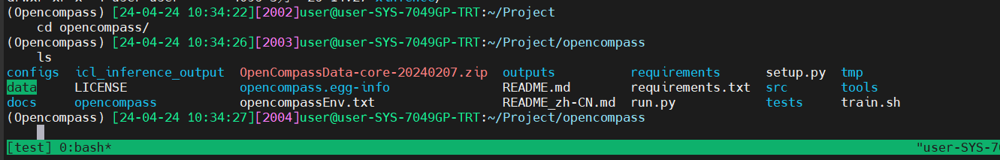
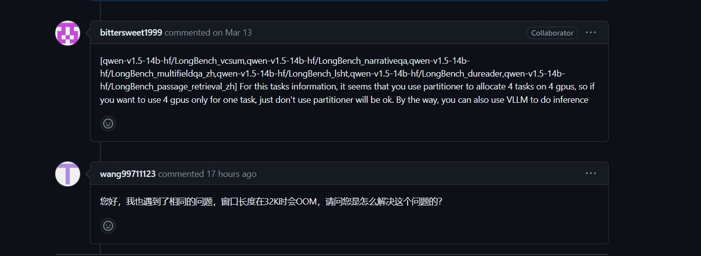

## 实战/将自定义数据集提交至OpenCompass官网

指南：[OpenCompass平台指引 | 贡献数据集 (qq.com)](https://link.zhihu.com/?target=https%3A//mp.weixin.qq.com/s/_s0a9nYRye0bmqVdwXRVCg)

访问网址：[https://hub.opencompass.org.cn/dataset-submit](https://link.zhihu.com/?target=https%3A//hub.opencompass.org.cn/dataset-submit)

创建一个 `markdown` 文件，当然其中的 url 用的是别人已经建好的库。

```text
---
name: Megumi
desc: A data set used to evaluate the llm's outputs whether adapted to the talking style of katou megumi or not.
dimension:
- language
sub_dimension:
- understanding
website: https://github.com/lupantech/ScienceQA
github: https://github.com/lupantech/ScienceQA
paper: https://arxiv.org/pdf/2209.09513.pdf
release_date: 2024-04-01
tag:
- roleplay
download_url: https://opendatalab.com/OpenDataLab/ScienceQA/explore/main
---
## Introduction
## Meta Data
## Example
## Citation
```


这里我尝试自己测评自己的模型，sql-coderllama.



基础环境已经布置好，在测试事遇到问题。

在上一期中已经提交问题，https://github.com/open-compass/opencompass/issues/879#issuecomment-2071776930

刚才在做总计的时候，发现还是有这个问题，

**When I was trying to reason the 13b model, I loaded the data set using only one card to run. My environment is 2*3090, and there are the following problems.torch.cuda.OutOfMemoryError: CUDA out of memory. Tried to allocate 136.00 MiB. GPU 0 has a total capacity of 23.48 GiB of which 124.81 MiB is free. Including non-PyTorch memory, this process has 23.31 GiB memory in use. Of the allocated memory 23.06 GiB is allocated by PyTorch, and 2.76 MiB is reserved by PyTorch but unallocated. If reserved but unallocated memory is large try setting PYTORCH_CUDA_ALLOC_CONF=expandable_segments:True to avoid fragmentation. See documentation for Memory Management (https://pytorch.org/docs/stable/notes/cuda.html#environment-variables).Loading checkpoint shards: 0%| | 0/3 [00:00<?, ?it/s]
Loading checkpoint shards: 33%|███▎ | 1/3 [00:04<00:09, 4.91s/it]
Loading checkpoint shards: 67%|██████▋ | 2/3 [00:09<00:04, 4.95s/it]
Loading checkpoint shards: 67%|██████▋ | 2/3 [00:11<00:05, 5.97s/it]
In fact, he only used the first card,
[](https://private-user-images.githubusercontent.com/104180186/312278517-09eafff0-3ff8-4922-834e-7e633165fe01.png?jwt=eyJhbGciOiJIUzI1NiIsInR5cCI6IkpXVCJ9.eyJpc3MiOiJnaXRodWIuY29tIiwiYXVkIjoicmF3LmdpdGh1YnVzZXJjb250ZW50LmNvbSIsImtleSI6ImtleTUiLCJleHAiOjE3MTM5MjY2NTEsIm5iZiI6MTcxMzkyNjM1MSwicGF0aCI6Ii8xMDQxODAxODYvMzEyMjc4NTE3LTA5ZWFmZmYwLTNmZjgtNDkyMi04MzRlLTdlNjMzMTY1ZmUwMS5wbmc_WC1BbXotQWxnb3JpdGhtPUFXUzQtSE1BQy1TSEEyNTYmWC1BbXotQ3JlZGVudGlhbD1BS0lBVkNPRFlMU0E1M1BRSzRaQSUyRjIwMjQwNDI0JTJGdXMtZWFzdC0xJTJGczMlMkZhd3M0X3JlcXVlc3QmWC1BbXotRGF0ZT0yMDI0MDQyNFQwMjM5MTFaJlgtQW16LUV4cGlyZXM9MzAwJlgtQW16LVNpZ25hdHVyZT02MGRjOWZkNjFiMTUzMDA2YzQ3ZjA4YzUwZmYxOGI3NWQ0NGQyYWM2OTMwYmYxOWI5MjE4ZjVjZmIyM2MwNTYzJlgtQW16LVNpZ25lZEhlYWRlcnM9aG9zdCZhY3Rvcl9pZD0wJmtleV9pZD0wJnJlcG9faWQ9MCJ9.JMNzWVb7RJxFsRWnHOMNZd8aD-5ayGqDsP-cdksgf4I)**

