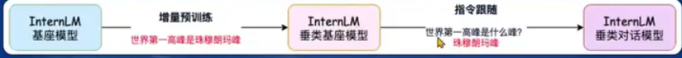

## Finetune 简介

### *两种范式*

1. *增量预训练：*让基座模型学习到新知识，使用基座模型，训练后得到垂类基座模型，使用文章、书籍和代码等作为训练数据
2. *指令微调：*让垂类基座模型学会对话模板，根据人类指令对话，得到垂类对话模型，使用高质量对话和问答数据，也是`SFT`方法中的一种。

标准格式数据需要包括 System/User/Assistant 角色标注，XTuner 中使用 json 格式存储，是给人看的数据

对话模板是为了模型输入序列数据能够让 LLM 区分出 System/User/Assistant，不同模型会有不同标注格式

我们只对答案部分打标签，进行损失计算。

### LoRA & QLoRA

*LoRA*：假定新训练的参数是原来模型线性参数的低秩表示，直接在原来的 Linear 旁新增一个支路，包含两个连续的小 Linear，新增的支路为 Adapter，大幅降低训练显存消耗。

*QLoRA*：相比于 LoRA 还需要加载完整的基模， QLoRA 直接加载4-bit 量化基模，优化器状态在 CPU 与 GPU 之间 Offload

## XTuner 介绍

*亮点：7B LLM，微调所需最小显存仅 8GB，支持多模态微调以及 Agent 微调*

对比记忆LLMfactory,性能效果和兼容性也比 llama-factory 要好

## 8GB显存玩转 LLM_e3

*两种加速方式：*

1. *Flash Attension：*并行计算 Attention，避免计算过程中 Attention Score 的显存占用，自动开启
2. *DeepSpeed ZeRo：*将训练过程中的参数、梯度和优化器状态切片保存，能够在多GPU训练时显著节省内存。训练时使用FP16权重，相较于 Pytorch 的 AMP 训练，单 GPU 上也能大幅节省内存。加参数设置。

